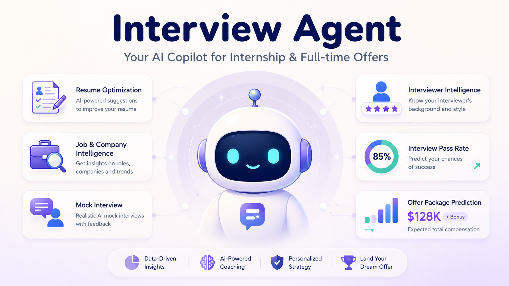

# Interview Agent



Interview Agent 是一个以 skills 为核心的人工智能面试准备仓库。它可以帮助候选人做岗位和面试官调研、修改简历、生成自我介绍、生成 mock 面试题、设计 mock 面试流程、预测通过率，并估算 offer package。

默认项目语言是英语。部分 `SKILL.md` 使用中英双语，方便中文用户准备英文或中文面试。

## 用法 (极简)

把下面这段直接丢给你的 agent/chat 工具，附上简历 + JD，然后按追问补充信息：

```text
使用本仓库的 interview-agent skill。

公司：
岗位：
级别：
地点：
阶段：
时间线：

输出：
1) Deep research（来源 + 置信度）
2) 简历改写 + 评分表
3) 30秒 / 90秒 / 2分钟自我介绍
4) Mock 面试流程 + 题库 + rubric
5) 通过率区间
6) Offer package 区间
```

单点需求用 focused skills：

```text
使用 skills/resume-rewrite ...
使用 skills/job-and-interviewer-research ...
使用 skills/self-introduction ...
使用 skills/mock-question-generator ...
使用 skills/mock-interview-flow ...
使用 skills/pass-probability ...
使用 skills/offer-package-estimator ...
```

## 快速开始

```bash
python -m venv .venv
source .venv/bin/activate
pip install -e .
interview-agent list-skills
interview-agent plan --company "Meta" --role "Senior Machine Learning Engineer" --level "E5"
```

## Deep Research 要求

针对具体公司或岗位时，必须广泛搜索公开资料后再回答，包括官方招聘页面、JD、工程博客、近期面经、GitHub 资料、LeetCode/Reddit/Blind 风格讨论、Levels.fyi 等薪酬数据。回答时需要引用来源，并区分事实、推断和个人建议。

## 免责声明

通过率和薪酬估算不是保证，只是基于公开证据、候选人材料和市场数据的规划工具。
